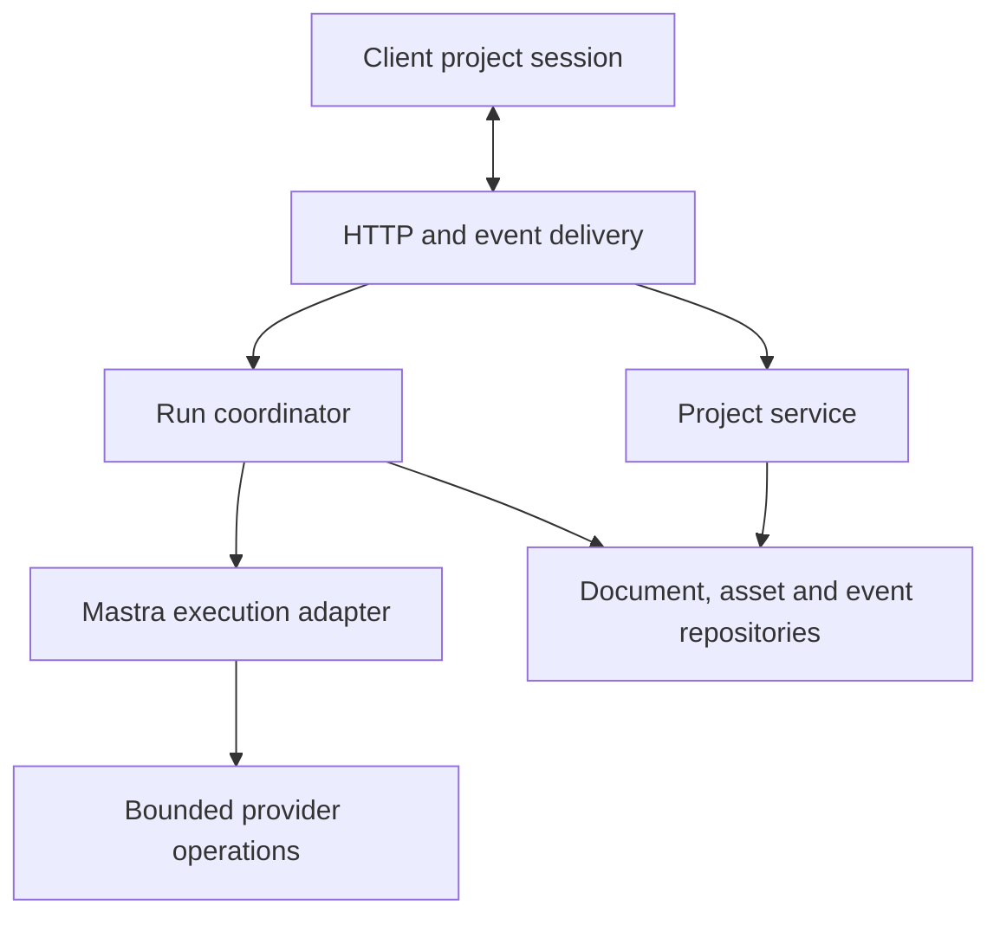

# Implementation Plans

The selected architecture backlog was written on 2026-09-05 against commit
`d2ae1e6c` plus the then-current uncommitted working tree. Plans 014–018 are implemented
and independently verified in the shared workspace alongside the current UI changes.
Each plan includes evidence, file fingerprints, scope, migration steps, tests,
and failure conditions. Independent workspace changes added draft-creation
idempotency and project brief/title identity during 015 review; preserve those
behaviors when integrating the architecture work.

## Architecture direction

Keep one local application server. Give it explicit runtime-owned dependencies
and boundaries around project storage, provider operations, run lifecycle, and
event delivery. Keep the shared conversation reducer and presentational UI.

- **Runtime:** constructs instances, production paths, provider ports, and disposal.
- **Storage:** commits documents/assets/events and exposes consistent snapshots.
- **Provider execution:** owns local deadlines, cancellation, operation draining,
  and provider-reported usage independently of artifact success.
- **Application services:** own accepted commands, idempotency, terminal records,
  recovery, and deletion.
- **Protocol/client session:** validate shared wire shapes and reconcile
  authoritative snapshots with live events and pending submissions.

Plans 014–015 retain the local file-backed project format. Plan 017 makes lifecycle
records authoritative and run-state metadata rebuildable. Plan 018 uses fresh
snapshots on reconnect; it does not require historical HTML replay.

## Execution order and status

| Plan | Title | Priority | Effort | Depends on | Status |
|---|---|---|---|---|---|
| [014](014-isolate-server-runtime.md) | Isolate server runtime dependencies and verification data | P1 | L | — | DONE; [report](014-report.md) |
| [015](015-durable-project-storage.md) | Make document commits, journals, and asset identities durable | P1 | L | 014 | DONE; [report](015-report.md) |
| [016](016-provider-execution.md) | Bound provider work, propagate cancellation, and retain known spend | P1 | L | 014, 015 | DONE; [report](016-report.md) |
| [017](017-run-lifecycle.md) | Give each run one durable lifecycle owner | P1 | L | 014, 015, 016 | DONE; [report](017-report.md) |
| [018](018-recoverable-event-protocol.md) | Share validated contracts and recover editor event subscriptions | P1 | L | 014, 015, 016, 017 | DONE; [report](018-report.md) |

Status values: TODO | IN PROGRESS | DONE | BLOCKED (reason) | REJECTED (reason).

Final delivery authorized by the user on 2026-09-06: once the selected architecture work is reviewed and verified, merge it to `main` and push. The user explicitly confirmed that this push includes all current app changes, including ongoing UI work. Refresh and verify the combined tree, preserve concurrent edits, and review the exact staged diff before publication; do not force-push.
Estimates cover the full architectural changes and tests; L means several days,
not a promise of completion time. Do not mark a plan DONE after writing it.

## Dependency and handoff contracts

Recommended sequence: **014 → 015 → 016 → 017 → 018**. Apply these serially because
several plans touch the same runtime, route, and storage modules. Provider work
comes before the coordinator because Stop and deletion need bounded draining.

- **014 → all:** isolated repository/bus/memory/provider instances, temporary test
  roots, denied unexpected network access, and awaited completion/disposal.
- **015 → 017/018:** atomic snapshot outcome classification, sticky journal
  failures, explicit recovery, monotonic committed sequences, immutable UUID
  assets with legacy readers, and a revision-checked consistent snapshot.
- **016 → 017:** bounded typed drain results, revoked late-write leases,
  explicit paid-request retry policy, and deduplicated known usage.
- **017 → 018:** durable acceptance before acknowledgment, canonical request
  digests, idempotent same-turn admission, one terminal owner, blocked-run
  reporting, and deletion gates/tombstones.
- **018:** contracts depend on conversation types, never the reverse; one
  continuous subscriber queue closes the snapshot/tail gap; new and legacy
  protocol versions coexist during migration.

Prerequisite changes to a plan's fingerprinted files are expected. Compare them
against the prerequisite implementation and stated handoff before proceeding;
do not restore obsolete excerpts or lose unrelated working-tree changes.

## Verification baseline and plan review

The audit's typecheck passed and lint passed with warnings. There were 362 passing
tests across the repo run and a focused rerun of 20 HTTP tests initially blocked
by sandbox socket permissions; one opt-in provider smoke was skipped, and some
results came from Turbo cache. Root format check stopped at existing formatting
in `packages/conversation/src/reducer.ts`. No build, paid-provider smoke,
browser QA, dependency-advisory review, or load/deployment verification was run.

Plan 014 removed the shared production-data test paths. Its independent server
checks passed, and a forced full repository run after integration passed 378
tests with one live-provider smoke test skipped. All ordinary verification must
explicitly disable that smoke test. See the [014 report](014-report.md) for scope,
commands, and limitations. Plan 015 adds durable storage and passed 430 uncached
repository tests after integration, with one live smoke skipped; see its
[report](015-report.md). Plan 016 passed 462 uncached repository tests after
integration, with one live smoke skipped; see its [report](016-report.md).
Plan 017 passed 505 uncached repository tests after integration, with one live
smoke skipped, and all 11 typecheck tasks; see its [report](017-report.md).
Plan 018 passed all five uncached repository gates after integration: 563 tests
passed and one live smoke was skipped. Independent browser QA verified two
editors, reload, Stop, completion, draft preservation, and live project-list
updates. The final combined tree includes the UI changes through `05d1044a`;
see the [018 report](018-report.md) for application and verification evidence.

All five plans received a cold read for executor ambiguity. Revisions clarified
partial journal failures, post-rename outcomes, coherent snapshot reads, finite
drain failure, deletion ownership, request digests, legacy recovery, continuous
SSE queue ordering, submission-result precedence, frame limits, and full list
snapshot semantics.

## Prior completed work

The following completion statuses are retained from the previous index. They
are historical records, not a new verification of the present working tree.
Do not execute an old plan solely because its code has since moved.

| Plan | Title | Recorded status |
|---|---|---|
| [001](001-delete-dead-legacy-turn-writers.md) | Delete dead legacy turn writers | DONE (previously recorded as moot) |
| [002](002-surface-log-write-failures.md) | Surface project log-write failures | DONE |
| [003](003-bound-turn-cache-with-lru.md) | Bound the turn cache | DONE |
| [004](004-delete-dead-grep-tool.md) | Delete dead grep tool | DONE |
| [005](005-accumulate-edit-warnings.md) | Accumulate edit warnings | DONE |
| [006](006-fix-stale-disconnect-comment.md) | Fix stale disconnect comment | DONE (superseded) |
| [007](007-server-base-url-from-config.md) | Derive server base URL from config | DONE |
| [008](008-generic-500-error-response.md) | Return generic 500 errors | DONE |
| [009](009-fallow-dead-code-green.md) | Restore dead-code gate | DONE |
| [010](010-bound-model-ids.md) | Bound model catalog IDs | DONE |
| [011](011-extract-run-agent-stream.md) | Extract stream orchestration units | DONE |
| [012](012-live-modalities-picker.md) | Use live model modalities | DONE |
| [013](013-direct-mode-e2e.md) | Verify direct-mode image delivery | DONE; [report](013-report.md) |

## Findings considered and deferred

- **Service/process splitting:** no demonstrated need for distributed workers
  in this local single-user app. Establish ownership and recovery first.
- **Replacing Mastra or blanket upgrades:** the provider patch and memory pin
  are documented compatibility requirements; changing them is outside this backlog.
- **Public screenshot publishing and no-JS capture:** existing product decisions,
  not independently classified as defects. Script-policy enforcement and a more
  faithful renderer deserve a separate review; these plans preserve that direction.
- **Version-history UI:** immutable storage provides groundwork, but this backlog
  does not add revision history or a restore interface.
- **Gallery thumbnails/pagination:** supported by the finding that each card
  fetches full project history; deferred until the reliability foundation lands.
- **Model catalog cache consolidation and extra image-pricing cache bounds:**
  prior review deferred these; they are not needed for the selected boundaries.
- **Cosmetic file splitting/display cleanup:** no standalone plan; move code only
  when ownership or executable contracts change.

The old rejection rationale describing `@workspace/agent-skills` as a dormant
package was removed because the current working tree moves its skills into the
server workspace. Historical plan files remain intact.
